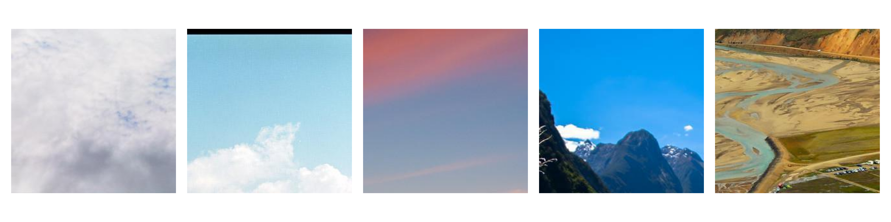
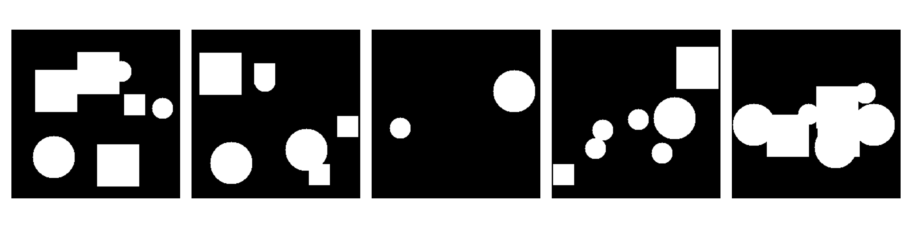
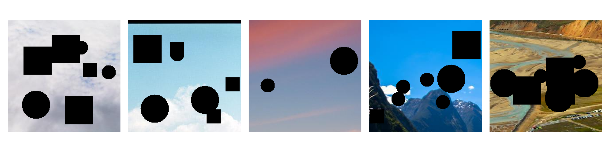
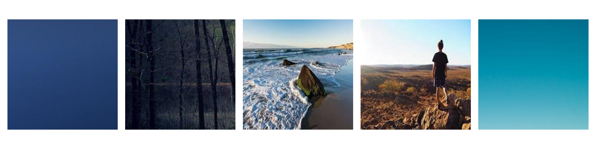
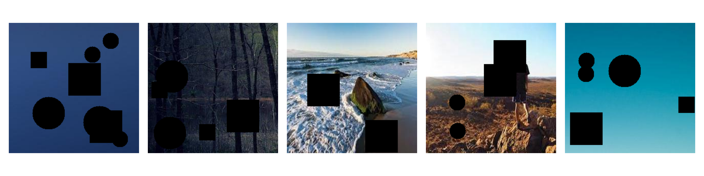
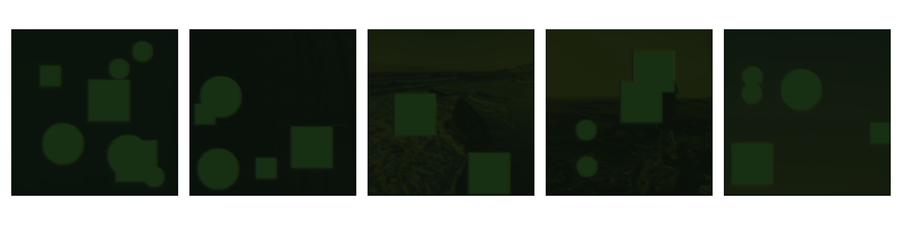
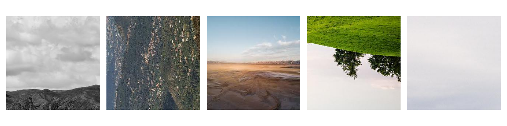
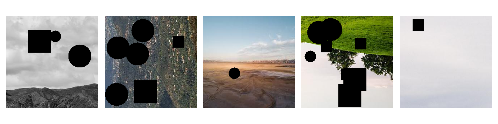
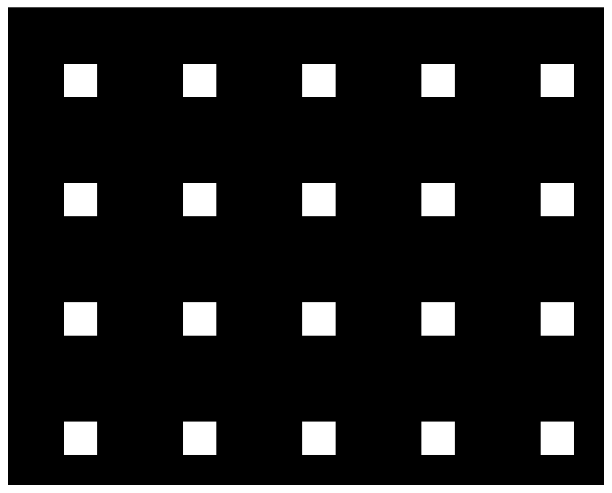

# In/Outpainting landscapes
## Introduction
---
## Installation
1. Clone the repository
```bash
git clone git@github.com:istepka/im-outpainting.git
```
2. Install the requirements
```bash
pip install -r requirements.txt
```
3. Download the data from the following url: https://1drv.ms/u/c/35ddce87939617c8/EWyelnH8qlJEgFNjAX_z3EABZiNsaDIGrOS8du5V52DSXA?e=mkizPd and uzip it into the `data/raw` folder.

## Usage
1. Prepare the data
```bash
python src/preprocess.py [DEFAULT OPTIONS: --data_dir data/raw, --out_dir data/processed, --num_workers CPU_COUNT, --size 256]
```
2. Train the model
```bash
python src/train.py [OPTIONS OPTIONS: --run_eval TRUE, --device GPU, --experiment_name JUST_GAN]
```

## Data sources 
The dataset is comprised of 16k images of landscapes. They were collected from the following sources:
1. Landscape Pictures (~4k images)
https://www.kaggle.com/datasets/arnaud58/landscape-pictures?rvi=1

1. Landscape Recognition Image Dataset (~12k images)
https://www.kaggle.com/datasets/utkarshsaxenadn/landscape-recognition-image-dataset-12k-images


## Architectures
*An Encoder-Decoder* architecture comprises two parts: an encoder to extract features and a decoder to generate output. It's commonly used for tasks like image translation or image generation.
Implementation: The Encoder-Decoder implementation here has separate encoder and decoder parts. The encoder consists of convolutional layers followed by batch normalization and ReLU activation. The decoder reverses this process, ending with a non-linear activation function.


*UNet* is a convolutional neural network architecture designed for semantic segmentation tasks. It consists of an encoder-decoder structure with skip connections, enabling precise localization.
Implementation: The UNet implementation provided has an encoder with three blocks, a bottleneck layer, and a decoder with corresponding blocks. Skip connections concatenate encoder and decoder feature maps.

Specification:
- Parameters: 2.7M
- Weight: ~ 10.6 MB
- Default config:
    - Epochs: 20
    - LR: 1e-3
    - Optimizer: Adam


## Dataset  
Dataset comes from two sources: 
- a flickr scrape:
-   
Train - 10k  
Val - 2k  
Test - 10k  

Example of images:


Masks:


Masks applied to images:



## Training

#### Images on first epoch: 

Original images




#### Images on the last epoch:




## Demo / some more images




## Grading
| What                              | Points | How                                                                     |
|-----------------------------------|--------|-------------------------------------------------------------------------|
| Image inpainting                  | 3      | The main goal                                                           |
| Own architecture (>50% own layers)| 2      | Encoder-Decoder CNN architecture                                        |
| 2nd own architecture with >50% own layers| 2 | Own UNet implementation                                            |
| Evaluation on a test set >= 10k   | 1      | Performed evaluation on 10,000 images in the test set                    |
| Testing various loss functions    | 1      | MSE, KLDivLoss, PoissonNLLoss, CELoss                                  |
| Testing various optimizers        | 1      | Adam, SGD, RMSprop, Adadelta                                           |
| Image augmentations               | 1      | Running random transformations on the input image before feeding it to the network |
| Weights & Biases                  | 1      | Wandb properly set up -- everything was tracked in it and I used data I saved to wandb for analysis |
| Run as Docker                     | 1      | Dockerfile provided in the main directory                              |
| REST API with GUI                 | 1      | Flask REST API with GUI allowing to upload masked image                 |
| RunPod   (DevOps)                 | 1      | Set up development environment with RunPod                              |
***
Total: 15


## License
MIT License

## References
[1] UNet + Attention: https://arxiv.org/pdf/2209.08850.pdf
[2] 