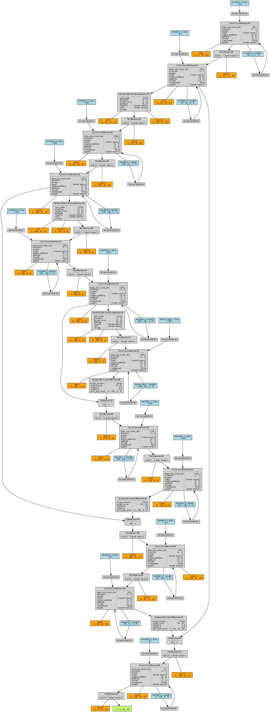
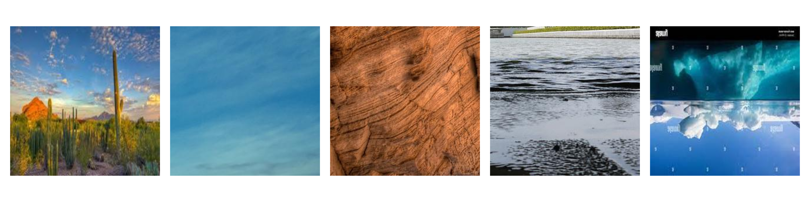
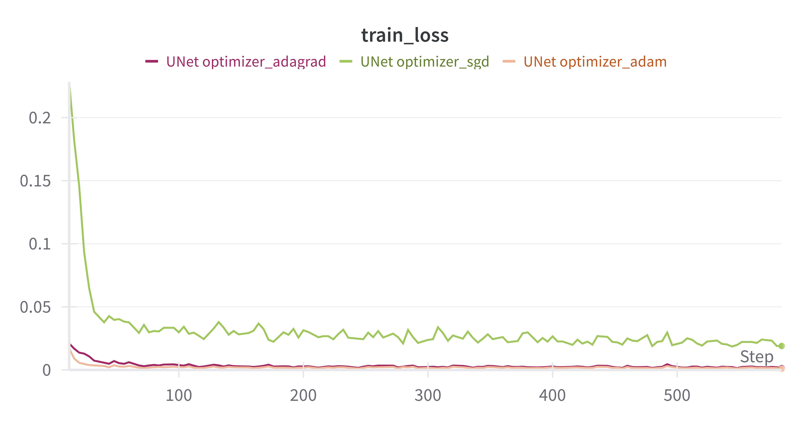
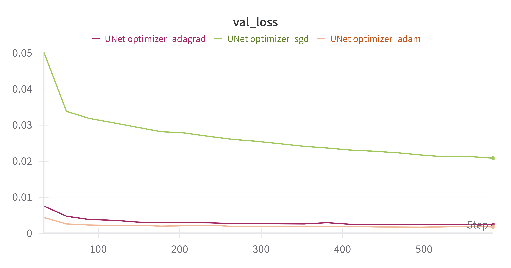
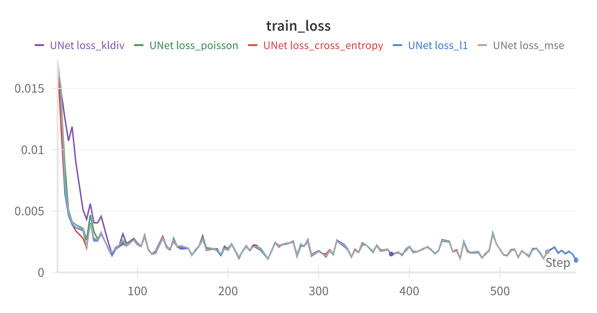
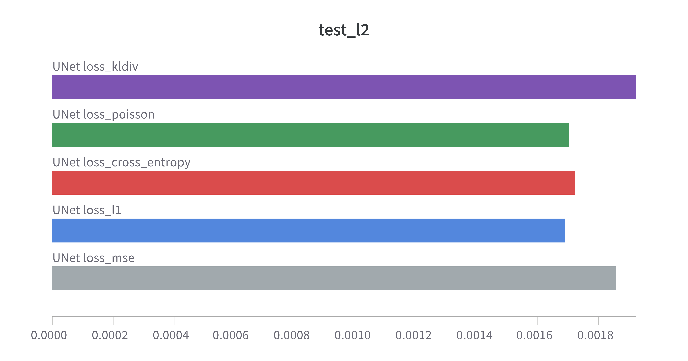
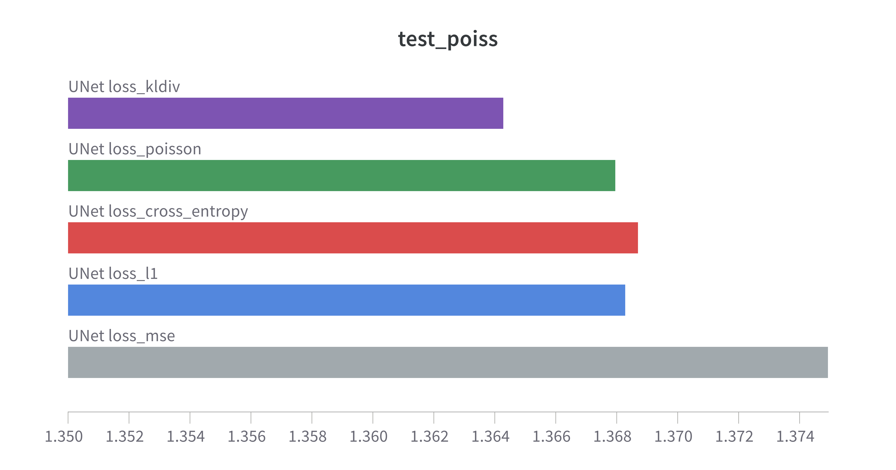
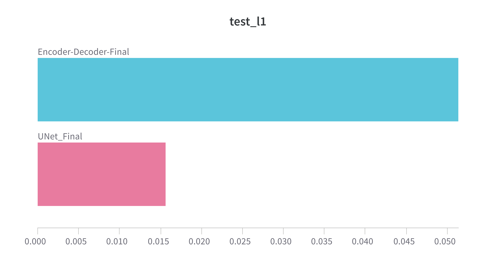
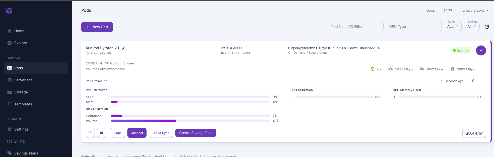
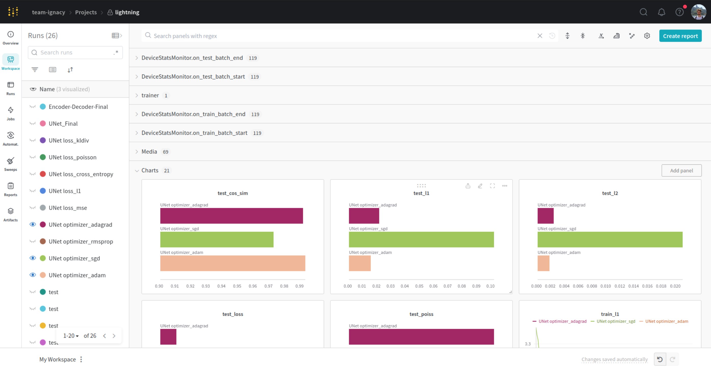

# Inpainting landscapes

## Introduction
This project is about inpainting images of landscapes. In this case, inpainting is based on the idea of masking parts of the image and then filling the missing parts with plausible content. 
---
## Installation
1. Clone the repository
```bash
git clone git@github.com:istepka/im-outpainting.git
```
2. Install the requirements
```bash
pip install -r requirements.txt
```
3. Download the data from the following url: https://1drv.ms/u/c/35ddce87939617c8/EWyelnH8qlJEgFNjAX_z3EABZiNsaDIGrOS8du5V52DSXA?e=mkizPd and uzip it into the `data/raw` folder.

## Usage
1. Prepare the data
```bash
python src/preprocess.py [DEFAULT OPTIONS: --data_dir data/raw, --out_dir data/processed, --num_workers CPU_COUNT, --size 256]
```
2. Train the model
```bash
python src/train.py [ OPTIONAL ARGUMENTS
    --optimizer ["adam", "SGD", "rmsprop", "adagrad", (default "adam")] 
    --epochs [INT, (default 20)]
    --batch_size [INT, (default 32)  
    --loss ["mse" "l1" "cross_entropy" "poisson" "kldiv", (default "mse")]
    --learning_rate [INT, (default 1e-3)]
    --model ["UNet", "Encoder-Decoder", (default "UNet")]
    --experiment_name [STR, (default $model)]
    ]
```

3. Demo  
    A demo for the purpose of this project is a Gradio UI. To run it, run the following command:
    ```bash
    python gradio_app.py
    ```
    Somewhat equivalent demo is in the juptyer notebook `demo.ipynb`.

## Data sources 
The dataset is comprised of 16k images of landscapes. They were collected from the following sources:
1. Landscape Pictures (~4k images)
https://www.kaggle.com/datasets/arnaud58/landscape-pictures?rvi=1

1. Landscape Recognition Image Dataset (~12k images)
https://www.kaggle.com/datasets/utkarshsaxenadn/landscape-recognition-image-dataset-12k-images

We cut-out 256x256 squares from images to create a larger dataset comprising of ~50k images instead of 16k. For experimentation purposes we decided to use smaller dataset size, so it is faster to train (and cheaper).   


**Data augumentation:**  
- Random left-right flips
- Rotations by 90 degrees only


**Splits:**   
- Train - 10k  
- Val - 2k  
- Test - 10k  

Example of images:


Masks:


Masks applied to images:


## Architectures
*An Encoder-Decoder* architecture comprises two parts: an encoder to extract features and a decoder to generate output. It's commonly used for tasks like image translation or image generation.
Implementation here has separate encoder and decoder parts. The encoder consists of convolutional layers followed by batch normalization and ReLU activation. The decoder reverses this process, ending with a non-linear activation function.

Specification:
- Parameters: ~744 K
- Weight: ~ 3 MB
- Inference time on CPU for a single image: ~ 0.12 s
- Default config:
    - Epochs: 20
    - LR: 1e-3
    - Optimizer: Adam  

Diagram generatred with torchviz: 


*UNet* is a convolutional neural network architecture designed for semantic segmentation tasks. It consists of an encoder-decoder structure with skip connections, enabling precise localization.
Implementation provided here has an encoder with three blocks, a bottleneck layer, and a decoder with corresponding blocks. Skip connections concatenate encoder and decoder feature maps.

Specification:
- Parameters: 2.7 M
- Weight: ~ 10.6 MB
- Inference time on CPU for a single image: ~ 0.19 s
- Default config:
    - Epochs: 20
    - LR: 1e-3
    - Optimizer: Adam


Diagram generatred with torchviz: 


For both models, the parameters chosen for training are the same, and are kind of an arbitrary, but informed, choice. I experimented on small subset of the data and chose the parameters that seemed to work the best. I also tried to keep the number of parameters as low as possible, so that the training is faster and cheaper.


## Training

#### Images on first epoch: 

Original images


#### Images on the last epoch:



I think the results are pretty good. We can see that the model is able to inpaint the images and fill the missing parts with plausible content. However, the input mask shapes are often pretty visible as blurry shapes. I believe being able to remove them would be a good next step for this project, but not an easy one. I would guess that we would have to use some sort of GAN architecture to achieve that or borrow some ideas from generative AI like loss function based on perceptual similarity or style transfer. Nevertheless, it is clear that model is able to kind of understand the context of the image and fill the missing parts with blurred, but very much plausible content (e.g. sky, grass, trees, edges, etc.).

## Demo / some more images


## Benchmarking

### Optimizers
Adam, SGD, RMSprop, Adagrad    

- Adam: Adaptive Moment Estimation combines adaptive learning rates for each parameter with momentum to improve training efficiency and converge faster. This is a classic optimizer for deep learning and basically the default choice.
- Stochastic Gradient Descent (SGD): Updates model parameters in the direction opposite to the gradient of the loss function with respect to the parameters, using a fixed learning rate.
- RMSprop: Root Mean Square Propagation adapts the learning rate for each parameter by dividing it by the root of the mean square of recent gradients, helping to prevent oscillations in training.
- Adagrad: Adapts the learning rate for each parameter based on the historical gradients, scaling down the learning rate for frequently occurring parameters and vice versa to focus on less frequently updated parameters.

*rmsprop is omitted in this visualizations because it achieved horrible results and makes it impossible to see anything useful on the plots.  
The most interesting takeaway from this benchmark is that SGD is consistently much worse than Adam and Adagrad. Adam and Adagrad are very similar in terms of performance, but Adam is just a bit better.




### Loss functions
Lossess used: MSE, L1, PoissonNLLoss, KLDivLoss, CrossEntropyLoss.   

- Mean Squared Error (MSE): Measures the average squared difference between predicted and target values, penalizing larger errors more heavily.
- L1 Loss (MAE): Computes the mean absolute difference between predicted and target values, providing a robust measure of error that is less sensitive to outliers.
- Poisson Negative Log Likelihood Loss (PoissonNLLLoss): Optimized for count data, it measures the negative log likelihood of a Poisson distribution to model the discrepancy between predicted and target values.
- Kullback-Leibler Divergence Loss (KLDivLoss): Measures how one probability distribution diverges from a second, typically a theoretical or target distribution, often used in variational autoencoders.
- Cross-Entropy Loss: Measures the difference between two probability distributions, commonly used in classification tasks to penalize incorrect classifications and encourage the model to assign higher probabilities to the correct class. However, we don't use it in it's binary form, but rather as a pixel-wise cross entropy loss.

Now, analysing loss functions. From train/val loss curves we see that all loss functions perform similarly. In terms of test MAE (L1) and MSE (L2) we see that L1 is the best choice and is closely followed by poisson loss. KLDiv is the worst choice.







### UNet vs Encoder-Decoder  
Encoder-Decoder architecure results clearly show that UNet is a better choice for this task. However, I have arbitrarly made the decision to have Encoder-Decoder as sort  of a smaller model for faster training. But, as we can see from the results, it's being outperformed by UNet by landslide.  
  

  

## Other
- **UI with Gradio**
    
To run the UI, run the following command:
    ```bash
    python gradio_app.py
    ```

- **Deployment for training in cloud (RunPod)**  

    I was running experiments using RunPod environment with RTXA5000 GPU. It allowed me to run experiments in the cloud and save the results to the cloud. It was very convenient and I would recommend it. Also, it isn't very expensive.
      


- **Docker image for Gradio App**
    ```bash
    # Build the image
    docker build -t inpainting .
    # Run the image
    docker run -p 8087:8087 inpainting
    # Now you can access the app at http://localhost:8087
    ```

- **WanDB tracking**  
    All experiments were tracked using Weights & Biases. I decided to use this tracking tool for the first time and I really liked it. It's very easy to use and it provides a nice UI and remote storage for all the experiments. Before, I was using MLFlow and I think I will stick with WanDB from now on.
    


## References
Related stuff that I used to understand the topic and implement the project: 
[1] UNet: https://arxiv.org/abs/1505.04597s  
[2] UNet + Attention: https://arxiv.org/pdf/2209.08850.pdf   
[3] II-GAN: https://ieeexplore.ieee.org/document/8322859    

## License
MIT License
