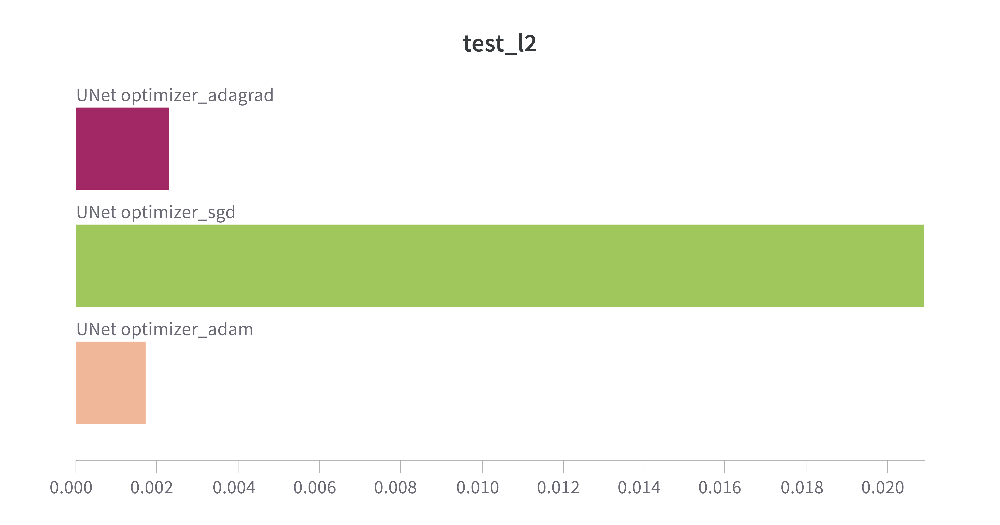

# Inpainting landscapes

## Introduction
#TODO

---
## Installation
1. Clone the repository
```bash
git clone git@github.com:istepka/im-outpainting.git
```
2. Install the requirements
```bash
pip install -r requirements.txt
```
3. Download the data from the following url: https://1drv.ms/u/c/35ddce87939617c8/EWyelnH8qlJEgFNjAX_z3EABZiNsaDIGrOS8du5V52DSXA?e=mkizPd and uzip it into the `data/raw` folder.

## Usage
1. Prepare the data
```bash
python src/preprocess.py [DEFAULT OPTIONS: --data_dir data/raw, --out_dir data/processed, --num_workers CPU_COUNT, --size 256]
```
2. Train the model
```bash
python src/train.py [ OPTIONAL ARGUMENTS
    --optimizer ["adam", "SGD", "rmsprop", "adagrad", (default "adam")] 
    --epochs [INT, (default 20)]
    --batch_size [INT, (default 32)  
    --loss ["mse" "l1" "cross_entropy" "poisson" "kldiv", (default "mse")]
    --learning_rate [INT, (default 1e-3)]
    --model ["UNet", "Encoder-Decoder", (default "UNet")]
    --experiment_name [STR, (default $model)]
    ]
```

## Data sources 
The dataset is comprised of 16k images of landscapes. They were collected from the following sources:
1. Landscape Pictures (~4k images)
https://www.kaggle.com/datasets/arnaud58/landscape-pictures?rvi=1

1. Landscape Recognition Image Dataset (~12k images)
https://www.kaggle.com/datasets/utkarshsaxenadn/landscape-recognition-image-dataset-12k-images

We cut-out 256x256 squares from images to create a larger dataset comprising of ~50k images instead of 16k. For experimentation purposes we decided to use smaller dataset size, so it is faster to train (and cheaper).   


**Data augumentation:**  
- Random left-right flips
- Rotations by 90 degrees only


**Splits:**   
- Train - 10k  
- Val - 2k  
- Test - 10k  

Example of images:


Masks:


Masks applied to images:


## Architectures
*An Encoder-Decoder* architecture comprises two parts: an encoder to extract features and a decoder to generate output. It's commonly used for tasks like image translation or image generation.
Implementation here has separate encoder and decoder parts. The encoder consists of convolutional layers followed by batch normalization and ReLU activation. The decoder reverses this process, ending with a non-linear activation function.

Specification:
- Parameters: ~744 K
- Weight: ~ 3 MB
- Default config:
    - Epochs: 20
    - LR: 1e-3
    - Optimizer: Adam


*UNet* is a convolutional neural network architecture designed for semantic segmentation tasks. It consists of an encoder-decoder structure with skip connections, enabling precise localization.
Implementation provided here has an encoder with three blocks, a bottleneck layer, and a decoder with corresponding blocks. Skip connections concatenate encoder and decoder feature maps.

Specification:
- Parameters: 2.7 M
- Weight: ~ 10.6 MB
- Default config:
    - Epochs: 20
    - LR: 1e-3
    - Optimizer: Adam


## Training

#### Images on first epoch: 

Original images


#### Images on the last epoch:


## Demo / some more images


## Benchmarking

### Optimizers
Adam, SGD, RMSprop, Adadelta  
*rmsprop is omitted in this visualizations because it achieved horrible results and makes it impossible to see anything useful on the plots.




### Loss functions
MSE, KLDivLoss, PoissonNLLoss, CELoss
TODO: Paste plots from wandb

### UNet vs Encoder-Decoder
TODO: Paste plots from wandb


## Grading
| What                              | Points | How                                                                     |
|-----------------------------------|--------|-------------------------------------------------------------------------|
| Image inpainting                  | 3      | The main goal                                                           |
| Own architecture (>50% own layers)| 2      | Encoder-Decoder CNN architecture                                        |
| 2nd own architecture with >50% own layers| 2 | Own UNet implementation                                            |
| Evaluation on a test set >= 10k   | 1      | Performed evaluation on 10,000 images in the test set                    |
| Testing various loss functions    | 1      | MSE, KLDivLoss, PoissonNLLoss, CELoss                                  |
| Testing various optimizers        | 1      | Adam, SGD, RMSprop, Adadelta                                           |
| Image augmentations               | 1      | Running random transformations on the input image before feeding it to the network |
| Weights & Biases                  | 1      | Wandb properly set up -- everything was tracked in it and I used data I saved to wandb for analysis |
| Run as Docker                     | 1      | Dockerfile provided in the main directory                              |
| REST API with GUI                 | 1      | Flask REST API with GUI allowing to upload masked image                 |
| RunPod   (DevOps)                 | 1      | Set up development environment with RunPod                              |
***
__Total: 15__


## References
[1] UNet: https://arxiv.org/abs/1505.04597s  
[2] UNet + Attention: https://arxiv.org/pdf/2209.08850.pdf   
[3] II-GAN: https://ieeexplore.ieee.org/document/8322859    

## License
MIT License
